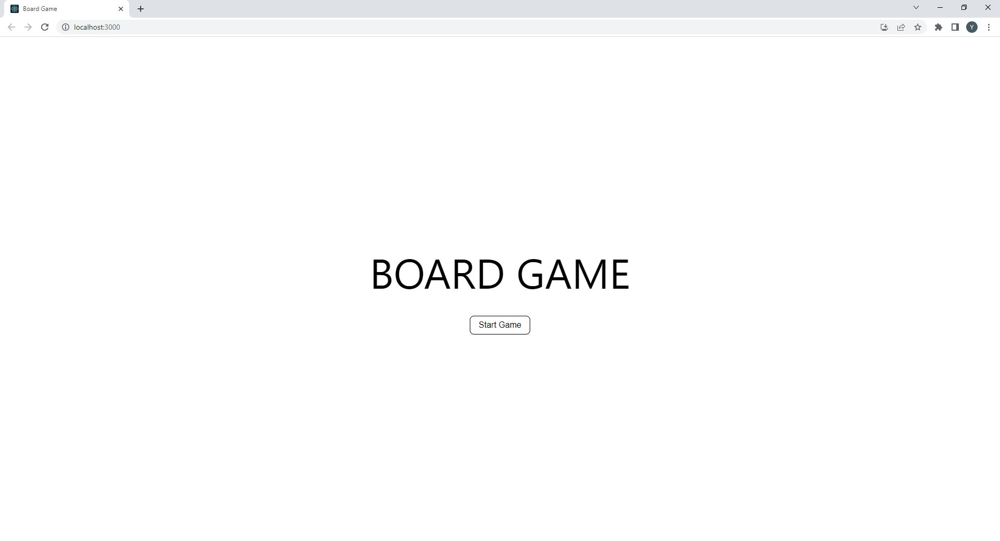
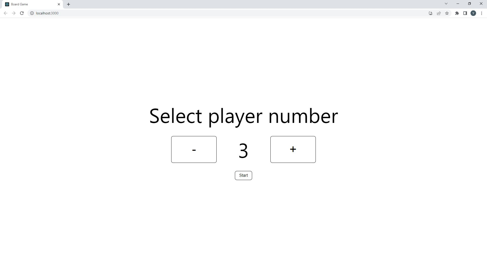
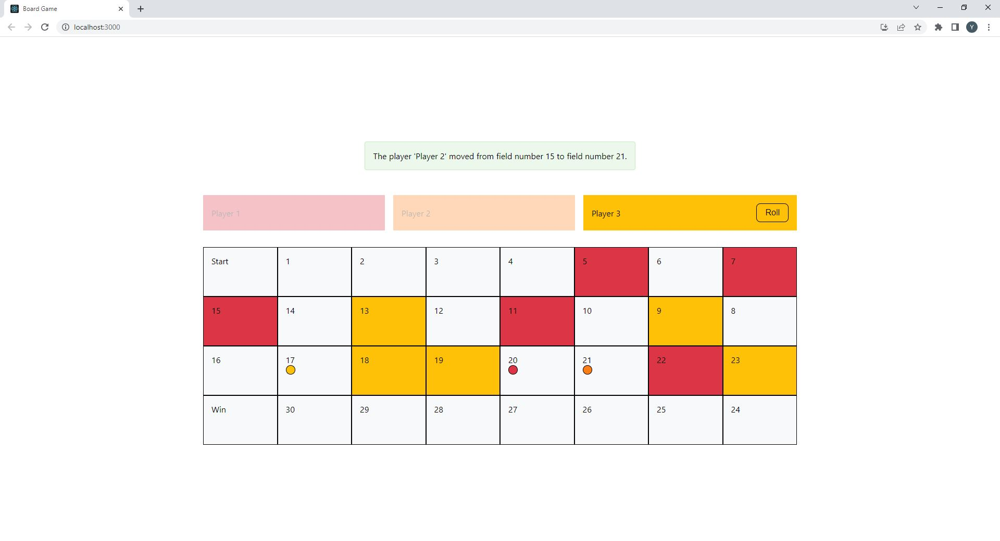
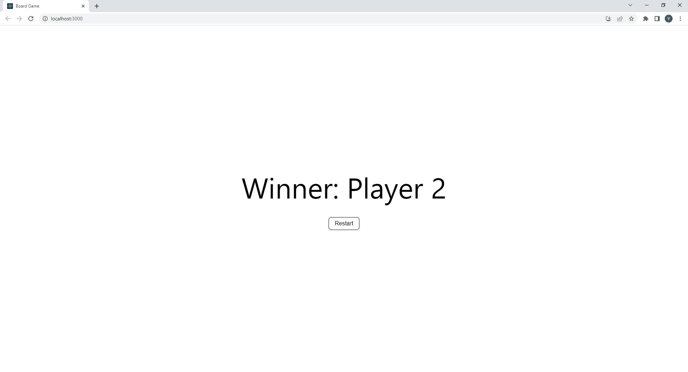

# Board Game

A board game built with React. This project is responsible for the UI of the game. The game logic worked in another microservice.

## How to Run the Project

To run the game, first clone this repository then run the following command.

    npm install
    npm start

## Screenshots

